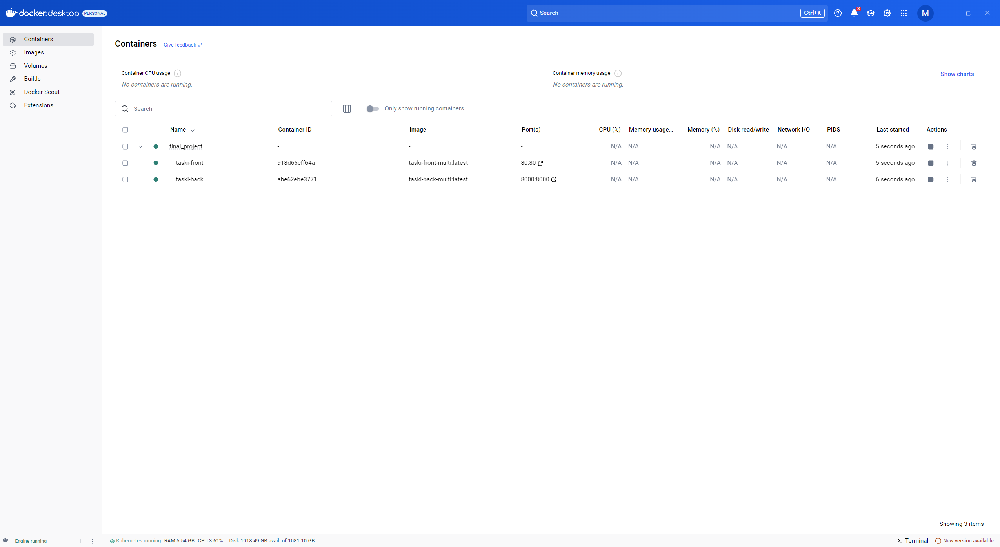
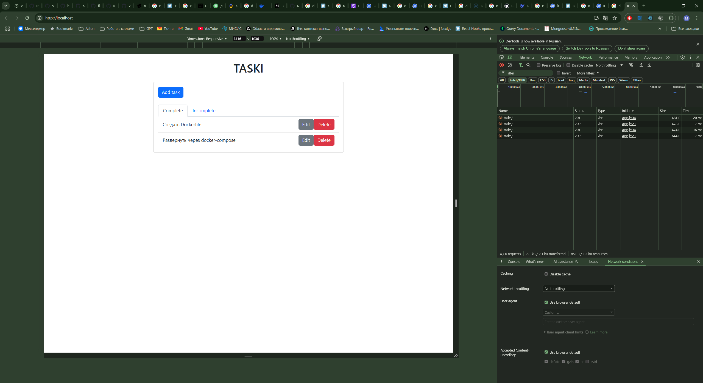
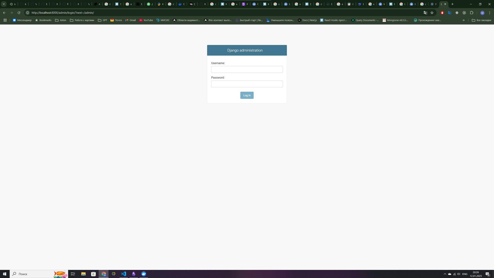
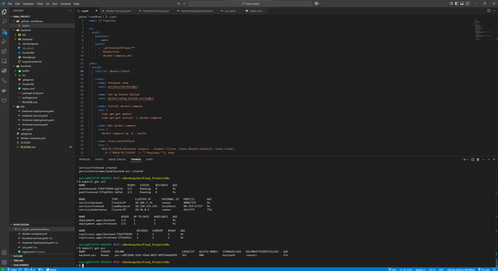
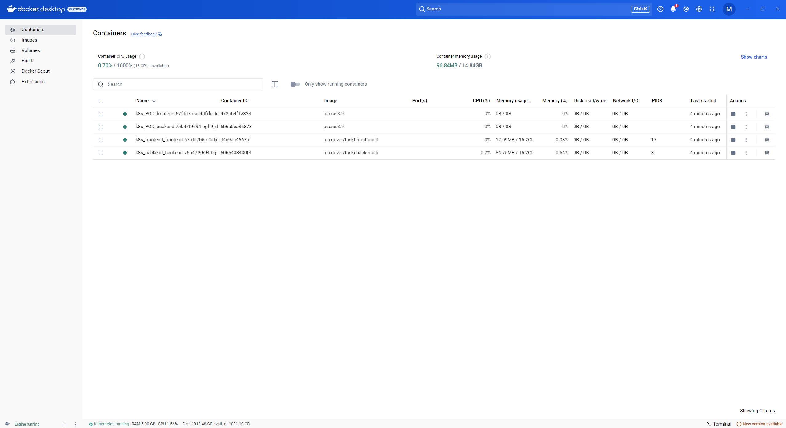
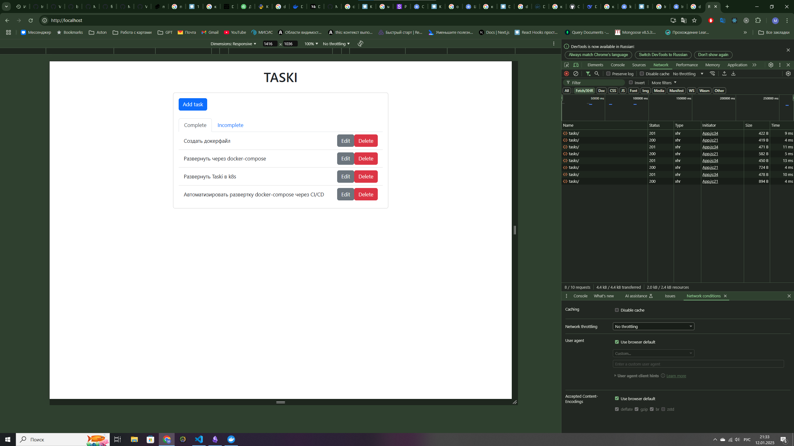

# Финальный проект

Задание для финального проекта: 

Необходимо: 
1. Создать докерфайл 
2. Развернуть через docker-compose 
3. Сделать multi-stage build 
4. * изменить хранение с SQLite на любую SQL базу 
5. Развернуть Taski в k8s (k8s кластер/minikube/microk8s) 
6. * Развернуть БД в k8s (k8s кластер/minikube/microk8s) 
7. Автоматизировать развертку docker-compose через CI/CD 
8. * Автоматизировать развертку в k8s через CI/CD 
9. Описать подробную документацию и инструкцию запуска в README 
10. * Настроить развертку и подготовку инфраструктуры через IaC инструменты (Terraform, Ansible) в рамках CI/CD

Для выполнения данного задания взят проект Taski:

- backend - python, django
- frontend - js, React

### Создание Dockerfile

Для выполнения данного этапа были созданы докерфайлы для frontend и бэкенд. Рассмотрим более подробно шаги выполнения первой задачи. 

#### Создание Dockerfile для фронта

Для сборки фронтенда используется мультистейдж сборка, для оптимизации размера итогового образа. 

- Для удобства переходим из корня проекта в папку frontend, для это в терминале нужно ввести команду.
	`cd frontend`
- Cоздаем Dockerfile, далее подробное описание Dockerfile
- Указываем базовый образ, который будет использоваться для сборки приложения .
	`FROM node:18 as build`
- Указываем команду для установки рабочей директории внутри контейнера как `/app`
	`WORKDIR /app`
- Указываем команду для копирования файлов `package.json` и `package-lock.json` из локальной директории в рабочую директорию контейнера, для установки зависимостей.
	`COPY package*.json ./`
- Далее указываем команду для установки зависимостей из `package-lock.json` 
	`RUN npm ci`
- Указываем команду для копирования всех файлов из  директории (где находиться Dockerfile, в нашем случае frontend )
	`COPY ..`
- Указываем команду для сборки фронта 
	`RUN npm run build`
- После этого указываем финальный образ для запуска
	`FROM nginx:alpine`
- Указываем команду для копирования nginx конфига(будет приведен далее).
	`COPY nginx.conf /etc/nginx/conf.d/default.conf`
- Указываем команду для копирования файлов из этапа build в директорию для размещения статических файлов.
	`COPY --from=build /app/build /usr/share/nginx/html`
- Указываем порт 
	`EXPOSE 80`
- Указываем команду для запуска при старте контейнера.
	`CMD ["nginx", "-g", "daemon off;"]`

Конфиг nginx

```
server {
    # Прослушивание порта 80 для IPv4.
    listen       80;
    # Прослушивание порта 80 для IPv6.
    listen  [::]:80;

    # Имя сервера. В данном случае это localhost.
    # Конфигурация будет применяться для запросов, направленных на localhost.
    server_name  localhost;

    # Устанавливает заголовок Host для проксируемых запросов.
    # Бэкенд получит правильное значение заголовка Host из исходного запроса.
    proxy_set_header Host $http_host;

    # Обработка запросов к корневому пути (/).
    location / {
        # Директория, где находятся статические файлы .
        root /usr/share/nginx/html;
        # Файл, который будет использоваться по умолчанию, если запрашивается директория.
        index index.html;

        # Пытается найти файл, соответствующий запрошенному URI.
        try_files $uri $uri/ /index.html;
    }

    # Обработка запросов, начинающихся с /api/.
    location /api/ {
        # Перенаправляет запросы на сервер бэкенда по адресу http://backend:8000/api/.
        proxy_pass http://backend:8000/api/;
    }

    # Обработка запросов, начинающихся с /admin/.
    location /admin/ {
        # Перенаправляет запросы на сервер бэкенда по адресу http://backend:8000/admin/.
        proxy_pass http://backend:8000/admin/;
    }

    # Указывает, что при возникновении ошибок 500, 502, 503 или 504 сервер должен вернуть страницу /50x.html.
    error_page   500 502 503 504  /50x.html;

    # Обработка запросов к /50x.html.
    location = /50x.html {
        # Директория, где находится файл 50x.html.
        root   /usr/share/nginx/html;
    }
}
```

Финальный образ фронта весит **74,71 MB**

#### Создание Dockerfile для бэкенда

Я пытался применить мультистейдж, но возникала ошибка без копирования зависимостей (manage.py не видел django). Поэтому финальный вес образа составил **164.73 MB**.  Далее будет представлен код из Dockerfile с комментариями.

```
FROM python:3.10 AS builder
ENV PYTHONUNBUFFERED=1
#Устанавливаем рабочую ддиректорию
WORKDIR /app
COPY requirements.txt /app
# Устанавливаем зависимости в директорию

RUN pip install --no-cache-dir --upgrade -r requirements.txt
# Копируем весь проект
COPY . /app

# Финальный этап: минимальный образ
FROM python:3.10-alpine
ENV PYTHONUNBUFFERED=1

# Устанавливаем рабочую директорию
WORKDIR /app

# Без этого не работает (копируем зависимости из builder)
COPY --from=builder /usr/local/lib/python3.10/site-packages /usr/local/lib/python3.10/site-packages

# Копируем из builder
COPY --from=builder /app /app
#Указываем порт
EXPOSE 8000
# Запускаем сервер Django
CMD [ "python3", "manage.py", "runserver", "0.0.0.0:8000" ]
```

### Развёртывание проекта с помощью docker-compose

В `docker-compose.yml`, описываются два сервиса frontend и backend.  

**Ключевые особенности:**

1) Добавлена зависимость, чтобы backend запускался до frontend
2) Для backend используется монтирование тома
3) Порты `frontend - 80`, `backend - 8000`
4) Настроен healthcheck для сервисов.
5) Добавление команды запуска для backend, для применения миграций.

Далее будет приведен код `docker-compose.yml` c комментариями.

```
frontend:
  # Используемый образ Docker. Если образ не найден, он будет собран.
  image: taski-front-multi:latest

  # Настройки сборки образа, если он отсутствует.
  build:
    # Контекст сборки — директория, где находится Dockerfile.
    context: ./frontend
    # Имя Dockerfile, который будет использоваться для сборки.
    dockerfile: Dockerfile

  # Имя контейнера после запуска.
  container_name: taski-front

  # Политика перезапуска контейнера:
  # always — контейнер всегда перезапускается после остановки.
  restart: always

  # Зависимости: frontend зависит от backend.
  depends_on:
    - backend

  # Проброс портов:
  ports:
    - '80:80'

  # Настройки healthcheck:
  healthcheck:
    # Команда для проверки здоровья: curl -f http://localhost/
    # -f означает "fail fast" (завершить с ошибкой, если сервер недоступен).
    test: ["CMD", "curl", "-f", "http://localhost/"]
    # Интервал между проверками: 1 минута 30 секунд.
    interval: 1m30s
    # Таймаут для выполнения команды: 30 секунд.
    timeout: 30s
    # Количество попыток перед тем, как контейнер будет считаться нездоровым.
    retries: 3
    # Время ожидания перед первой проверкой: 30 секунд.
    start_period: 30s
    
backend:
  # Используемый образ Docker. Если образ не найден, он будет собран.
  image: taski-back-multi:latest

  # Настройки сборки образа, если он отсутствует.
  build:
    # Контекст сборки — директория, где находится Dockerfile.
    context: ./backend
    # Имя Dockerfile, который будет использоваться для сборки.
    dockerfile: Dockerfile

  # Имя контейнера после запуска.
  container_name: taski-back

  # Команда, которая выполняется при запуске контейнера:
  # 1. Запуск сервера Django на порту 8000
  # 2. Применение миграций
  command: sh -c "python manage.py runserver 0.0.0.0:8000 && python manage.py migrate"

  # Политика перезапуска контейнера:
  # always — контейнер всегда перезапускается после остановки.
  restart: always

  # Проброс портов:
  ports:
    - "8000:8000"

  # Тома (volumes):
  volumes:
    - ./backend:/app

  # Настройки healthcheck (проверка здоровья контейнера):
  healthcheck:
    # Команда для проверки здоровья: curl -f http://localhost:8000
    # -f означает "fail fast" (завершить с ошибкой, если сервер недоступен).
    test: ["CMD", "curl", "-f", "http://localhost:8000"]
    # Интервал между проверками: 1 минута 30 секунд.
    interval: 1m30s
    # Таймаут для выполнения команды: 30 секунд.
    timeout: 30s
    # Количество попыток перед тем, как контейнер будет считаться нездоровым.
    retries: 3
    # Время ожидания перед первой проверкой: 30 секунд.
    start_period: 30s
```

### Развертывание проекта в k8s

Для развертывания проекта необходимо создать следующие k8s манифесты: 

1) backend-deployment.yaml
3) backend-service.yaml 
4) frontend-deployment.yaml
5) frontend-service.yaml
6) pvc.yaml

**Ключевые особенности:** 

- **backend-deployment.yaml**
	1) `replicas: 1` , для масштабирования можно указать больше
	2) `image: maxtever/taski-back-multi:latest`, используется образ из dockerhub, чтобы брался исключительно с локального нужно задать `imagePullPolicy`, и задать имя образа из docker-compose.yml
	3) монтируется том `backend-data`, который использует PersistentVolumeClaim (PVC) с именем `backend-pvc`
	4) дополнительно пришлось внести команду для запуска миграций, так как при запуске с локальных образов возникала ошибка с бд
- **backend-service.yaml** 
	1) сервис будет доступен на порту 8000.
	2) запросы будут перенаправляться на порт 8000 контейнера.
- **pvc.yaml**
	1) PersistentVolumeClaim запрашивает хранилище у Kubernetes
	2) задан **accessModes: ReadWriteOnce** может быть смонтирован только на одном узле с правами на чтение и запись.
	3) запрашивает 1 гигабайт хранилища 
```
	resources:
	    requests:
	      storage: 1Gi
```

- **frontend-deployment.yaml**
	1) `replicas: 1` , для масштабирования можно указать больше
	2) `image: maxtever/taski-front-multi:latest`, используется образ из dockerhub, чтобы брался исключительно с локального нужно задать `imagePullPolicy`, и задать имя образа из docker-compose.yml
- **frontend-service.yaml**
	1) type: LoadBalancer
	2) сервис будет доступен на 80 порту 
	3) запросы будут перенаправляться на 80 порт

### Автоматизация развертки docker-compose через Github Actions

**Описание:**

Данный workflow, запускается при пуше в ветку main, если изменения затрагивают следующие файлы или папки: 
- `.github/worflows/**`
- `Dockerfile`
- `docker-compose.yml`

Описание основных задач: 
- Собирает и запускает контейнеры с помощью docker-compose
- Проверяет состояние контейнеров фронта и бэка с помощью healthcheck
- Останавливает контейнеры после завершения проверок

Далее представлен код ci.yml с комментариями

```
#Название workflow
name: CI Pipeline

# Триггеры для запуска workflow
on:
  push:
    branches:
      - main
    paths:
      - '.github/workflows/**'  
      - 'Dockerfile'  
      - 'docker-compose.yml'  
        
# Задачи, которые выполняются в workflow
jobs:
  build:
  # ВМ, на которой выполняется задача
    runs-on: ubuntu-latest
    # Шаги в рамках задачи
    steps:
    
    # Клонирование репозитория
    - name: Checkout code
      uses: actions/checkout@v3
      
    # Настройка Docker Buildx
    - name: Set up Docker Buildx
      uses: docker/setup-buildx-action@v2
      
    # Установка Docker-compose
    - name: Install docker-compose
      run: |
        sudo apt-get update
        sudo apt-get install -y docker-compose
        
	# Запуск контейнеров с docker-compose c пересборкой образов
    - name: Run docker-compose
      run: |
        docker-compose up -d --build
        
    # Проверка состояния контейнера фронта
    - name: front_healthCheck
      run: |
        HEALTH_STATUS=$(docker inspect --format='{{json .State.Health.Status}}' taski-front)
          if ["$HEALTH_STATUS" != "\"healthy\""]; then
            echo "Front is not healthy"
            exit 1
          else
            echo "Front is healthy"
          fi
    # Проверка состояния контейнера бэка
    - name: back_healthCheck
      run: |
        HEALTH_STATUS=$(docker inspect --format='{{json .State.Health.Status}}' taski-back)
          if ["$HEALTH_STATUS" != "\"healthy\""]; then
            echo "Back is not healthy"
            exit 1
          else
            echo "Back is healthy"
          fi
      # Остановка
    - name: Stop docker-compose
      run: |
        docker-compose down
```

### Инструкция

1) Для запуска проекта нужно склонировать репозиторий командой: 

```
git clone https://github.com/MaxTever/Final_Project.git
```

2) Перейти в папку с проектом
3) Запустить docker-compose командой: 
	```
	docker-compose up -d --build
	```

**Результат:** 



Для проверки работоспособности приложения откроем браузер и перейдем по адресу: 

`http://localhost:80`

В результате мы видим работающий фронт и также видно из скриншота, что запросы отправляются на сервер и все корректно отрабатывает.



Также можно перейти в админку бэкенда по адресу: 

`http://localhost:8000/admin`




4) Далее завершаем работу docker-compose командой: 
	`docker-compose down`

**Запуск k8s**

1) Переходим в папку где лежат манифесты k8s командой:
   `cd k8s`
2) Есть два варианта запуска: 
- Запуск вручную каждого манифеста командами: 
```
kubectl apply -f backend-deployment.yaml
kubectl apply -f backend-service.yaml
kubectl apply -f frontend-deployment.yaml
kubectl apply -f frontend-service.yaml
kubectl apply -f pvc.yaml
```
- Запуск одной командой: 
	`kubectl apply -f .`

**Результаты:** 

Выполним команду для просмотра всех ресурсов и команду для просмотра PVC: 

	`kubcetl get all`
	`kubectl get pvc`






Затем откроем браузер по адресу: 

	`http://localhost:80`



В результате мы видим работающий фронт и также видно из скриншота, что запросы отправляются на сервер и все корректно отрабатывает.

#### Важно

Если возникает ошибка с пулом образов из dockerhub при запуске k8s, необходимо изменить название образов в `kubectl apply -f backend-deployment.yaml` и `kubectl apply -f frontend-deployment.yaml`, а также раскомментировать строчку `imagePullPolicy` .

- `taski-front-multi:latest`  # для фронта
- `taski-back-multi:latest`  # для бэка

